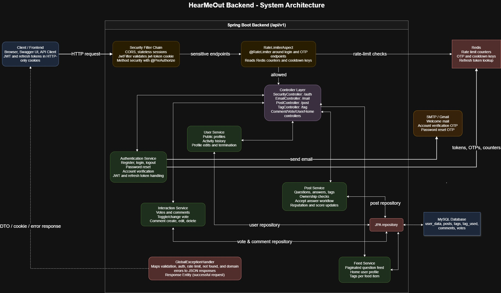
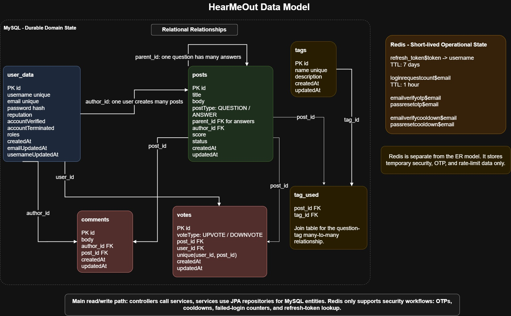

# HearMeOut Backend – Q&A Platform

[](https://openjdk.org)
[](https://spring.io/projects/spring-boot)
[](https://www.mysql.com/)
[](https://redis.io/)
[](https://www.docker.com/)

**HearMeOut** is a StackOverflow-style Q&A platform backend built with Java 21 and Spring Boot. It uses a modular monolith architecture organised by feature domain, JWT-based authentication via HTTP-only cookies, Redis-powered rate limiting, email OTP flows, and auto-generated OpenAPI documentation.


##  Features

| Category | Details |
| :--- | :--- |
| **Authentication** | Register, Login, Logout with JWT in HTTP-only cookies; Access + Refresh token pair |
| **Account Verification** | Email OTP-based account activation on registration |
| **Password Reset** | Email OTP-based password recovery flow |
| **Questions & Answers** | Create, Read, Update, Delete questions and answers with full ownership validation |
| **Answer Acceptance** | Question authors can toggle an answer's accepted/unaccepted status |
| **Comments** | Post, edit, and delete comments on any question or answer |
| **Voting** | Upvote / downvote questions and answers; toggle or change a vote in a single call |
| **Tag Management** | Paginated tag listing; admin-only tag creation |
| **Home Feed** | Paginated, sorted question feed with per-user vote context injected at query time |
| **User Profiles** | Public profiles with paginated activity history (questions, answers, comments) |
| **Rate Limiting** | AOP-driven `@RateLimiter` backed by Redis for login attempts and OTP requests |
| **Request Logging** | Structured log output per request (request ID, method, URI, level) via `LoggingFilter` |
| **API Documentation** | Auto-generated Swagger UI via Springdoc OpenAPI |
| **Docker Support** | Multi-stage Dockerfile — builds a minimal production image |

---

##  Tech Stack

| Layer                    | Technology                                                       |
| :-------------------------| :-----------------------------------------------------------------|
| Language                 | Java 21                                                          |
| Framework                | Spring Boot 4.0.3 (WebMVC, Security, Data JPA, Validation, Mail) |
| Primary Database         | MySQL                                                            |
| Cache / Rate-limit Store | Redis 7+                                                         |
| Auth                     | JJWT 0.13 — JWT stored in HTTP-only cookies                      |
| API Docs                 | Springdoc OpenAPI 3.0.2 + Swagger UI                             |
| Containerisation         | Docker (multi-stage build with Eclipse Temurin 21)               |
| Build Tool               | Maven (Maven Wrapper included)                                   |
| Utilities                | Lombok, Jakarta Bean Validation                                  |

---

## Project Structure

The project follows a **package-by-feature** (modular monolith) layout. Each domain service is self-contained with its own `controller`, `service`, `model`, `dto`, `mapper`, and `repository` sub-packages.

```text
HearMeOut_Backend/
├── env_file/
│   └──  env-structure           # List of required environment variable names
├── assets/                     # ER diagram and other static assets
├── src/
│   └── main/
│       ├── java/com/project/hearmeout_backend/
│       │   ├── HearMeOutBackendApplication.java
│       │   │
│       │   ├── authentication_service/   # Register, Login, Logout, JWT, OTP flows
│       │   │   ├── config/               # Spring Security configuration
│       │   │   ├── controller/           # SecurityController, EmailController
│       │   │   ├── dto/                  # Login, Register, OTP request/response DTOs
│       │   │   ├── model/                # CustomUserDetails
│       │   │   └── service/              # JwtService, SecurityService, EmailService ...
│       │   │
│       │   ├── user_service/             # User profiles, account history
│       │   │   ├── controller/           # UserController
│       │   │   ├── dto/                  # Profile request/response DTOs
│       │   │   ├── mapper/               # UserMapper
│       │   │   ├── model/                # User entity
│       │   │   ├── repository/
│       │   │   └── service/              # UserService
│       │   │
│       │   ├── post_service/             # Questions, Answers, Tags
│       │   │   ├── controller/           # PostController, TagController
│       │   │   ├── dto/                  # Submit/response DTOs
│       │   │   ├── mapper/
│       │   │   ├── model/                # Post, Tag entities
│       │   │   ├── repository/
│       │   │   └── service/              # PostService, TagService
│       │   │
│       │   ├── interaction_service/      # Votes and Comments
│       │   │   ├── controller/           # VoteController, CommentController
│       │   │   ├── dto/
│       │   │   ├── mapper/
│       │   │   ├── model/                # Vote, Comment entities
│       │   │   ├── repository/
│       │   │   └── service/              # VoteService, CommentService
│       │   │
│       │   ├── feed_service/             # Home feed generation
│       │   │   ├── controller/           # HomeController
│       │   │   ├── dto/
│       │   │   └── service/              # HomeService
│       │   │
│       │   ├── gateway/                  # Cross-cutting concerns
│       │   │   ├── annotation/           # @RateLimiter custom annotation
│       │   │   ├── aspect/               # RateLimiterAspect (AOP)
│       │   │   ├── config/               # WebMvcConfig (CORS etc.)
│       │   │   ├── dto/                  # ExceptionResponseDTO
│       │   │   ├── filter/               # JwtFilter, LoggingFilter
│       │   │   └── model/                # RateLimits enum
│       │   │
│       │   ├── common_lib/               # Shared utilities
│       │   │   ├── config/               # Global exception handler, API response wrapper
│       │   │   └── exception/            # Custom exception classes
│       │   │
│       │   ├── administration_service/   # (Upcoming) Admin controls
│       │   └── notification_service/     # (Upcoming) Live notifications
│       │
│       └── resources/
│           ├── application.yml           # Shared configuration (port, context path, mail, JWT)
│           ├── application-dev.yml       # Dev profile (local MySQL + Redis)
│           ├── application-docker.yml    # Docker profile (container networking)
│           └── application-prod.yml      # Production profile
│
├── Dockerfile                            # Multi-stage production build
├── pom.xml
└── mvnw / mvnw.cmd
```

---

## System Workflow Diagram

<p align="center">
  
</p>

---

## Environment Variables

Create a file at `env_file/.env` using the variable names from `env_file/env-structure` as a reference:

| Variable | Description | Example |
| :--- | :--- | :--- |
| `SPRING_ACTIVE_PROFILE` | Active Spring profile (`dev` / `docker` / `prod`) | `dev` |
| `PORT` | Port the server listens on | `8080` |
| `DB_HOST` | MySQL host | `localhost` |
| `DB_PORT` | MySQL port | `3306` |
| `DB_USER` | MySQL username | `root` |
| `DB_PASS` | MySQL password | `yourpassword` |
| `DB_DATABASE` | MySQL database name | `hearmeout` |
| `SECRET_KEY` | 512-bit JWT signing secret (hex/base64) | `...` |
| `MAIL_USER` | SMTP sender email address | `you@gmail.com` |
| `MAIL_PASS` | Gmail App Password (not your login password) | `xxxx xxxx xxxx xxxx` |

> **Gmail tip:** Go to Google Account → Security → App Passwords and generate a 16-character app password to use as `MAIL_PASS`.

---

## Getting Started

### Prerequisites

- Java 21 JDK
- Maven 3.9+ (or use the included `mvnw` / `mvnw.cmd` wrapper)
- MySQL 8+
- Redis 7+ (required for rate limiting — runs on `localhost:6379` in dev)
- Docker (optional)

---

### Run Locally

```bash
# 1. Clone
git clone https://github.com/rarestpreet/HearMeOut_Backend.git
cd HearMeOut_Backend

# 2. Create your .env file
copy env_file\env-structure env_file\.env   # Windows
# cp env_file/env-structure env_file/.env   # Linux / macOS
# Then open env_file/.env and fill in your values

# 3. Make sure MySQL and Redis are running
#    MySQL: create a database named 'hearmeout' if it doesn't exist
#    Redis: start with default settings (port 6379)

# 4. Run via Maven Wrapper
./mvnw spring-boot:run          # Linux / macOS
mvnw.cmd spring-boot:run        # Windows
```

The application starts at:

```
http://localhost:8080/api/v1
```

---

### Run with Docker

The project includes a multi-stage `Dockerfile` that compiles and packages the application from source.

```bash
# Build the image
docker build -t hearmeout-backend .

# Run the container (supply your .env file)
docker run -d \
  -p 8080:8080 \
  --env-file env_file/.env \
  --name hearmeout-app \
  hearmeout-backend
```

> When running in Docker and your MySQL/Redis are on the host machine, set `DB_HOST=host.docker.internal` in your `.env` file (macOS/Windows). On Linux, use the host's bridge IP or run via `docker-compose`.

---

## Testing with Swagger UI

Once the server is running, open the interactive API documentation in your browser:

```
http://localhost:8080/api/v1/docs
```

**Quickstart flow:**

1. **Register** — create a user account.
2. **Login** — the server sets an HTTP-only JWT cookie on your browser session. Swagger UI will automatically attach it to subsequent requests.
3. **Verify email** *(optional)* — request an OTP, then confirm it to verify your account.
4. **Create a question** — provide a title, body, and array of existing tag IDs.
5. **Browse the feed** — no auth required.
6. **Answer, comment, vote** — interact with the platform seamlessly.

> **Note:** Swagger UI in a browser handles cookies automatically. For tools like `curl` or Postman, capture the `Set-Cookie` header from the login response and forward it in subsequent requests.

---

## ER diagram for models (DB Entity)
<p align="center">
  
</p>
